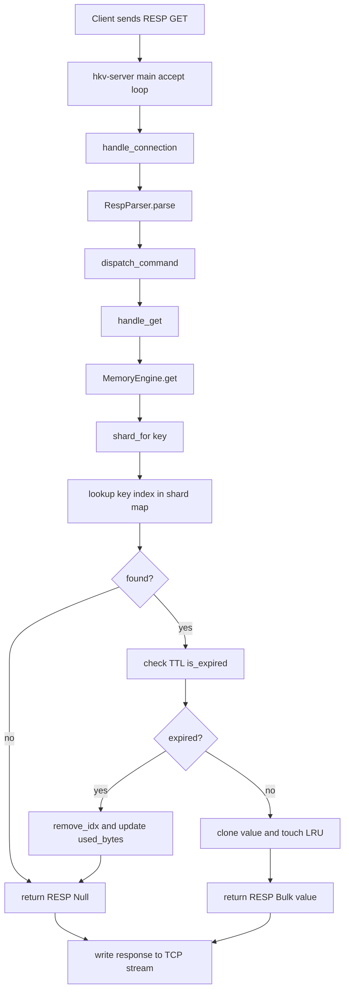

# HybridKV GET Read Flow

## Code anchors

- Connection entry: `hkv-server/src/main.rs:22`
- Request loop and parser: `hkv-server/src/server.rs:18`, `hkv-server/src/protocol.rs:53`
- Command dispatch and GET handler: `hkv-server/src/server.rs:47`, `hkv-server/src/server.rs:86`
- Engine read path: `hkv-engine/src/memory.rs:451`

## GitNexus evidence used

- `context` for `main`, `dispatch_command`, `handle_get`, `get`
- Process chain including `Main -> Resp_null` and `Get -> Shard_index`
